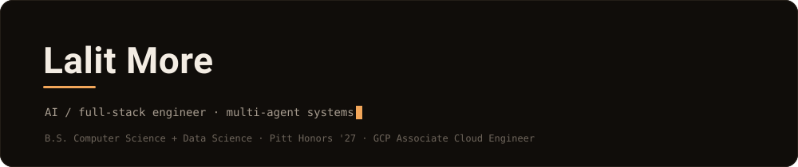

<!--
  Lalit More — profile README.
  Drop this repo's contents into  github.com/lalitmore/lalitmore  (repo name MUST equal your username).
  Only one visual asset: assets/banner.svg. Everything else is plain markdown.
  See SETUP.md before pushing (two source links to confirm).
-->

  

  
  &nbsp;
  
  &nbsp;
  

 

I build AI systems that ship — multi-agent orchestration, deterministic solvers as guardrails for unreliable model reasoning, and typed schemas as quality gates. Computer Science + Data Science at the University of Pittsburgh Honors College (class of 2027). Looking for new-grad roles in AI/ML and cloud engineering.

 

### Featured work

**[Atlas AI](https://github.com/lalitmore/Atlas-AI)** — Multi-agent travel planner. A plain-English prompt becomes a route-optimized, day-by-day itinerary via four Gemini 2.5 agents on Google ADK, with trip sequencing offloaded to a pure-Python 2-opt TSP solver so the model only writes against a provably optimal route.

**[VO2](https://github.com/lalitmore?tab=repositories)** — Research-grade wearable analytics. Ingests longitudinal WHOOP / Oura / Garmin data and runs statistically rigorous self-experiments grounded in PubMed literature. *Best AI for Decision Support — CMU TartanHacks.*

**[Competitive Intelligence Agent](https://github.com/lalitmore/ai-research-agent)** — Real-time intel on any public company in under 30 seconds. An agentic loop on the Anthropic Claude API with live web search, deployed to Cloud Run with scale-to-zero (\$0 at rest).

 

### Stack

Python · Java · SQL · React · Next.js · FastAPI · GCP · Cloud Run · BigQuery · dbt · Docker · PyTorch · Pydantic

 

### Experience

- **SAP Analyst, Procure-to-Pay Intern** — Gordon Food Service *(2026 – now)*
- **Undergraduate Research Assistant** — LLaMA + LoRA fine-tuning, LangGraph multi-agent packet-trace analysis for real-time cyberattack detection, University of Pittsburgh *(2025 – now)*
- **Teaching Assistant, Data Structures & Algorithms** — University of Pittsburgh *(2025 – now)*
- Google Cloud Certified — Associate Cloud Engineer *(2025)*

 

  <a href="https://linkedin.com/in/lalitmore">LinkedIn</a> &nbsp;·&nbsp;
  <a href="mailto:lalit.anil.more@gmail.com">Email</a> &nbsp;·&nbsp;
  <a href="https://github.com/lalitmore">GitHub</a>

